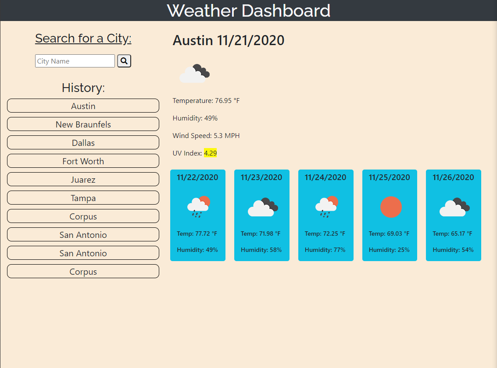

# Weather Dashboard
```
Live Site: 
```

The Weather dashboard uses a server API to retrieve information about a city's weather. The app displays current weather conditions for the searched city. These conditions include the date searched, image representing the current conditions, temperature, humidity, wind speed, and UV index. The number for the UV index is also highlighted to represent how severe the number is. Also, when searching for a city, a 5 day forecast is also given for the city. The 5 day forecast shows the date, an image of the predicted weather condition, temperature and humidity. The user's recent searches are also saved and displayed for them. The most recent search is also retreived when loading the app. The searches can also be clicked to re-search that city.

The following image demonstrates the application functionality:



